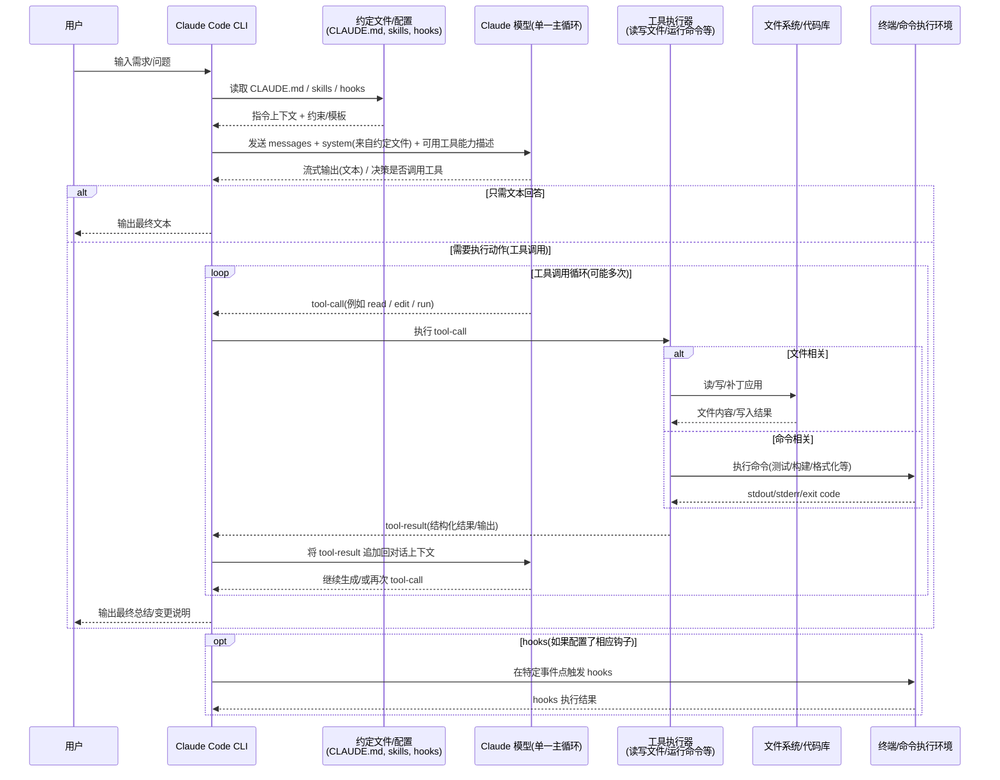

# Claude Code CLI 的 “Agents” 如何运行？以及 Oh-My-OpenCode 是否是“主 Agent 指挥其他 Agent”

本文用于回答两个问题：

- Claude Code CLI 里的 “agents” 是怎么跑的？是不是有一个 master agent 指挥其他 agent？什么时候某个 agent 开始工作？
- Oh-My-OpenCode 是不是“主 agent 指挥其他 agent 干活”？OpenCode 什么时候会调用其他 agent？

> 重要说明：Claude Code 的内部实现细节并非全部开源/可引用。本文对 Claude Code 的部分，以 **公开可观察行为** 为主（“概念模型”）。  
> OpenCode 的部分则以本仓库真实代码为准，并给出关键代码落点。

---

## 1) Claude Code CLI：更像“单一主循环 + 工具调用 +（可选）hooks”

### 结论（回答你的两个核心问题）

- **是否有 master agent 指挥其他 agent？**  
  从公开使用形态看，Claude Code 更像 **一个主对话循环（单一主 agent/单一模型实例）** 在规划与决策；它会在需要时触发工具/动作。  
  你可能会“感觉像多个 agent”，但更多是模型内部的任务拆分策略，并不等价于 OpenCode 那种“可注册/可切换的多 Agent 实体”。

- **什么时候某个 agent 开始工作？**  
  在 Claude Code 的外显行为里：**用户发送一条 prompt 时**，主循环开始；随后在同一轮里可能多次 **tool-call → 观察结果 → 继续生成**，直到这轮结束。下一轮则由用户下一次输入触发。

### Mermaid 时序图（概念模型）



---

## 2) OpenCode / Oh-My-OpenCode：不是“插件当 master”，而是“主对话驱动 + 可显式调用 subagent”

### 2.1 先回答：Oh-My-OpenCode 是 master agent 吗？

**不是。**  
Oh-My-OpenCode（作为插件）更像是 **“预置/注入一组 agent、tool、skill 和默认配置”**。  
真正决定“是否/何时调用其他 agent”的，是 **当前这轮正在跑的模型（主对话循环）** ——它会在合适时机触发 OpenCode 的 `task` 工具（或通过命令/配置生成 `subtask` part），从而让某个 subagent 开始工作。

换句话说：

- **插件做的事**：把“可用的 subagent”准备好（配置、描述、权限、可用工具等）。  
- **运行时调度**：由主对话模型决定（或用户显式指定），OpenCode 再按机制创建/运行 subagent 会话。

### 2.2 OpenCode 里“什么时候调用其他 agent？”

OpenCode 有两类“触发 subagent”的路径（都能理解为“什么时候某个 agent 开始工作”）：

#### A) 用户显式触发：`@agent`（跳过部分检查，更像手动点名）

当用户在本轮消息里显式点名 agent（解析为 `AgentPart`），OpenCode 会设置 `bypassAgentCheck = true`，传入工具执行上下文，用于跳过某些“是否允许自动调用 subagent”的检查。

关键代码（用户本轮显式 `@agent` → `bypassAgentCheck`）：

```556:568:packages/opencode/src/session/prompt.ts
      // Check if user explicitly invoked an agent via @ in this turn
      const lastUserMsg = msgs.findLast((m) => m.info.role === "user")
      const bypassAgentCheck = lastUserMsg?.parts.some((p) => p.type === "agent") ?? false

      const tools = await resolveTools({
        agent,
        session,
        model,
        tools: lastUser.tools,
        processor,
        bypassAgentCheck,
        messages: msgs,
      })
```

#### B) 模型/命令触发：生成 `subtask` part → 会话循环优先执行它

OpenCode 会把 “subtask” 当作一种 **待执行队列**：在主循环里优先取出并执行。  
这意味着：当某轮里产生了 `subtask` part，下一次循环就会“切到该 subagent 干活”。

关键代码（会话循环扫描 `subtask` 并优先执行）：

```281:371:packages/opencode/src/session/prompt.ts
      let tasks: (MessageV2.CompactionPart | MessageV2.SubtaskPart)[] = []
      for (let i = msgs.length - 1; i >= 0; i--) {
        const msg = msgs[i]
        // ...
        const task = msg.parts.filter((part) => part.type === "compaction" || part.type === "subtask")
        if (task && !lastFinished) {
          tasks.push(...task)
        }
      }
      // ...
      const task = tasks.pop()

      // pending subtask
      if (task?.type === "subtask") {
        const taskTool = await TaskTool.init()
        // ... 创建 assistantMessage + tool part ...
        const taskArgs = {
          prompt: task.prompt,
          description: task.description,
          subagent_type: task.agent,
          command: task.command,
        }
```

关键代码（执行 subtask 时，强制 `bypassAgentCheck: true`，避免再问“能不能调用 subagent”）：

```381:413:packages/opencode/src/session/prompt.ts
        const taskCtx: Tool.Context = {
          agent: task.agent,
          messageID: assistantMessage.id,
          sessionID: sessionID,
          abort,
          callID: part.callID,
          extra: { bypassAgentCheck: true },
          messages: msgs,
          // ...
        }
        const result = await taskTool.execute(taskArgs, taskCtx).catch((error) => {
          executionError = error
          // ...
          return undefined
        })
```

### 2.3 `task` 工具本身：OpenCode 的“subagent 运行器”

`task` 工具是 OpenCode 里把“调用 subagent”做成系统能力的核心：它会列出可用的 subagent，并在执行时为 subagent **创建一个子 session**，然后把 prompt 送进去跑 `SessionPrompt.prompt()`。

关键代码（`task` 工具只列出非 primary 的 agent，也就是“可被调用的 subagent”）：

```23:30:packages/opencode/src/tool/task.ts
export const TaskTool = Tool.define("task", async (ctx) => {
  const agents = await Agent.list().then((x) => x.filter((a) => a.mode !== "primary"))

  // Filter agents by permissions if agent provided
  const caller = ctx?.agent
  const accessibleAgents = caller
    ? agents.filter((a) => PermissionNext.evaluate("task", a.name, caller.permission).action !== "deny")
    : agents
```

关键代码（如果没有 `bypassAgentCheck`，会先走权限询问；否则跳过）：

```44:55:packages/opencode/src/tool/task.ts
      // Skip permission check when user explicitly invoked via @ or command subtask
      if (!ctx.extra?.bypassAgentCheck) {
        await ctx.ask({
          permission: "task",
          patterns: [params.subagent_type],
          always: ["*"],
          metadata: {
            description: params.description,
            subagent_type: params.subagent_type,
          },
        })
      }
```

关键代码（创建 subagent 子 session，并调用 `SessionPrompt.prompt()` 开跑）：

```68:165:packages/opencode/src/tool/task.ts
        return await Session.create({
          parentID: ctx.sessionID,
          title: params.description + ` (@${agent.name} subagent)`,
          permission: [
            // ... 一些 deny/allow 规则 ...
          ],
        })
      })
      // ...
      const result = await SessionPrompt.prompt({
        messageID,
        sessionID: session.id,
        model: {
          modelID: model.modelID,
          providerID: model.providerID,
        },
        agent: agent.name,
        tools: {
          todowrite: false,
          todoread: false,
          ...(hasTaskPermission ? {} : { task: false }),
          // ...
        },
        parts: promptParts,
      })
```

### 2.4 Mermaid 时序图：OpenCode “主循环调用 subagent（task/subtask）”

```mermaid
sequenceDiagram
    participant User as 用户
    participant Main as 主对话循环(当前 Agent)
    participant Loop as SessionPrompt.loop()
    participant TR as ToolRegistry/Tools
    participant Perm as PermissionNext
    participant Task as task工具(TaskTool)
    participant Sub as Subagent会话(子session)

    User->>Main: 输入需求(可能包含 @agent)
    Main->>Loop: 进入 loop，加载消息历史

    alt 用户显式 @agent
        Loop->>Loop: bypassAgentCheck = true
    else 未显式点名
        Loop->>Loop: bypassAgentCheck = false
    end

    Loop->>TR: resolveTools(带上 bypassAgentCheck)
    TR-->>Loop: 工具列表(包含 task 工具)

    alt 模型决定委派子任务
        Main-->>Loop: 产生 subtask part 或调用 task 工具
    end

    alt 走 subtask 队列
        Loop->>Loop: 扫描 messages 中 subtask parts
        Loop->>Task: 执行 taskTool.execute(subagent_type=task.agent)
    else 直接 tool-call(task)
        Loop->>Task: 执行 taskTool.execute(subagent_type=目标agent)
    end

    opt bypassAgentCheck 为 false
        Task->>Perm: ask(permission=task, patterns=[subagent])
        Perm-->>Task: allow/deny
    end

    Task->>Sub: 创建子 session + SessionPrompt.prompt()
    Sub-->>Task: 子 session 输出(工具结果/文本)
    Task-->>Loop: 将结果作为 tool-result 反馈回主循环
    Loop-->>Main: 主循环基于结果继续执行
    Main-->>User: 最终输出
```

---

## 3) 一句话总结（对你的问题做最直给的回答）

- Claude Code：公开行为更像 **一个主对话循环** 在做事；“多 agent”更像隐式策略，不等同可配置的多 Agent 实体。
- OpenCode / Oh-My-OpenCode：**插件不当 master**；插件只是“预置更多 subagent”，真正“什么时候调用其他 agent”由主循环决定，触发路径主要是：
  - 用户显式 `@agent`（`bypassAgentCheck`）
  - 模型产生 `subtask`（或直接 tool-call `task`）→ `SessionPrompt.loop()` 优先执行 → `TaskTool` 创建子 session 运行该 subagent。

