# 20260130 问题解答

本文档详细解答 `wantKnow0130.md` 中的三个问题。

---

## 问题 1: 大模型怎么调用 commands/tools？补充各个流程可以画图，时间线图和流程图，并且解释一下核心代码

### 概述

OpenCode 使用 **AI SDK** 的 `streamText` API 来实现工具调用。整个流程分为几个阶段：
1. **工具注册**：将可用工具注册到 AI SDK
2. **LLM 调用**：发送消息和工具定义给大模型
3. **工具调用检测**：从流式响应中检测工具调用
4. **工具执行**：执行工具并返回结果
5. **结果反馈**：将工具结果反馈给 LLM 继续对话

### 流程图

```
┌─────────────────────────────────────────────────────────────────┐
│                     工具调用完整流程                              │
└─────────────────────────────────────────────────────────────────┘

1. 初始化阶段
   ┌──────────────┐
   │ Session.loop │ 启动会话循环
   └──────┬───────┘
          │
          ▼
   ┌─────────────────────────────────────┐
   │ 1. 加载工具列表                      │
   │    ToolRegistry.tools()              │
   │    - 内置工具 (read, write, edit...) │
   │    - 插件工具 (Plugin.list())        │
   │    - 本地工具 (.opencode/tool/*)    │
   └──────────────┬──────────────────────┘
                  │
                  ▼
   ┌─────────────────────────────────────┐
   │ 2. 准备 LLM 调用参数                 │
   │    - messages (历史对话)             │
   │    - tools (工具定义)                │
   │    - system prompt                   │
   └──────────────┬──────────────────────┘
                  │
                  ▼
2. LLM 调用阶段
   ┌─────────────────────────────────────┐
   │ 3. LLM.stream()                      │
   │    - 调用 AI SDK streamText()        │
   │    - 传入工具定义                    │
   └──────────────┬──────────────────────┘
                  │
                  ▼
   ┌─────────────────────────────────────┐
   │ 4. 流式响应处理                       │
   │    SessionProcessor.process()        │
   │    - 监听 stream events              │
   │    - 检测 tool-call 事件            │
   └──────────────┬──────────────────────┘
                  │
                  ▼
3. 工具调用检测
   ┌─────────────────────────────────────┐
   │ 5. 检测到 tool-call 事件              │
   │    - toolCallId                      │
   │    - toolName                        │
   │    - input (参数)                    │
   └──────────────┬──────────────────────┘
                  │
                  ▼
   ┌─────────────────────────────────────┐
   │ 6. 创建 Tool Part                    │
   │    Session.updatePart()              │
   │    - status: "running"               │
   │    - 记录开始时间                    │
   └──────────────┬──────────────────────┘
                  │
                  ▼
4. 工具执行阶段
   ┌─────────────────────────────────────┐
   │ 7. 查找工具定义                       │
   │    ToolRegistry.get(toolName)        │
   └──────────────┬──────────────────────┘
                  │
                  ▼
   ┌─────────────────────────────────────┐
   │ 8. 验证参数                          │
   │    tool.parameters.parse(input)      │
   └──────────────┬──────────────────────┘
                  │
                  ▼
   ┌─────────────────────────────────────┐
   │ 9. 触发插件钩子                      │
   │    Plugin.trigger(                  │
   │      "tool.execute.before"           │
   │    )                                 │
   └──────────────┬──────────────────────┘
                  │
                  ▼
   ┌─────────────────────────────────────┐
   │ 10. 执行工具                        │
   │     tool.execute(params, ctx)       │
   │     - 实际执行工具逻辑               │
   │     - 返回结果                       │
   └──────────────┬──────────────────────┘
                  │
                  ▼
   ┌─────────────────────────────────────┐
   │ 11. 触发插件钩子                     │
   │     Plugin.trigger(                 │
   │       "tool.execute.after"          │
   │     )                                │
   └──────────────┬──────────────────────┘
                  │
                  ▼
   ┌─────────────────────────────────────┐
   │ 12. 更新 Tool Part                   │
   │     Session.updatePart()             │
   │     - status: "completed"            │
   │     - output: 结果                   │
   └──────────────┬──────────────────────┘
                  │
                  ▼
5. 结果反馈阶段
   ┌─────────────────────────────────────┐
   │ 13. 将工具结果添加到消息历史          │
   │     MessageV2.addToolResult()        │
   └──────────────┬──────────────────────┘
                  │
                  ▼
   ┌─────────────────────────────────────┐
   │ 14. 继续会话循环                     │
   │     Session.loop()                  │
   │     - 将工具结果作为新消息发送        │
   │     - LLM 基于结果继续生成           │
   └─────────────────────────────────────┘
```

### 时间线图

```
时间轴：用户发送消息 → LLM 响应 → 工具调用 → 工具执行 → 结果反馈 → LLM 继续

T0: 用户发送消息
    └─> Session.loop() 启动

T1: 准备工具列表 (并行)
    ├─> ToolRegistry.tools()
    ├─> 加载内置工具
    ├─> 加载插件工具
    └─> 加载本地工具

T2: 构建 LLM 调用参数
    ├─> 准备 messages (历史对话)
    ├─> 准备 tools (工具定义 JSON Schema)
    └─> 准备 system prompt

T3: 调用 LLM.stream()
    └─> AI SDK streamText()
        └─> 发送 HTTP 请求到 Provider API

T4: 接收流式响应 (持续)
    ├─> text-delta: 文本片段
    ├─> tool-call: 工具调用请求 ⭐
    └─> finish: 完成

T5: 检测到 tool-call 事件
    ├─> 提取 toolCallId, toolName, input
    ├─> 创建 Tool Part (status: "running")
    └─> 记录开始时间

T6: 查找并验证工具
    ├─> ToolRegistry.get(toolName)
    ├─> tool.parameters.parse(input)
    └─> 参数验证通过

T7: 执行工具 (可能耗时)
    ├─> Plugin.trigger("tool.execute.before")
    ├─> tool.execute(params, ctx)
    │   └─> 实际执行（如 read file, run bash...）
    └─> Plugin.trigger("tool.execute.after")

T8: 更新工具结果
    ├─> Session.updatePart(status: "completed")
    ├─> 记录 output, metadata, title
    └─> 记录结束时间

T9: 将结果添加到消息历史
    └─> MessageV2.addToolResult()

T10: 继续会话循环
     └─> Session.loop() 继续
         └─> 将工具结果作为新消息发送给 LLM
             └─> LLM 基于结果继续生成响应
```

### 核心代码解析

#### 1. 工具注册 (`packages/opencode/src/tool/registry.ts`)

```typescript
// 获取所有可用工具
export async function tools(
  model: { providerID: string; modelID: string },
  agent?: Agent.Info,
) {
  const tools = await all()  // 获取所有工具（内置+插件+本地）
  const result = await Promise.all(
    tools
      .filter((t) => {
        // 根据模型和配置过滤工具
        if (t.id === "codesearch" || t.id === "websearch") {
          return model.providerID === "opencode" || Flag.OPENCODE_ENABLE_EXA
        }
        return true
      })
      .map(async (t) => {
          return {
            id: t.id,
            ...(await t.init({ agent })),  // 初始化工具，返回 description 和 parameters
          }
        }),
  )
  return result  // 返回 AI SDK 格式的工具定义
}
```

#### 2. LLM 调用 (`packages/opencode/src/session/llm.ts`)

```typescript
export async function stream(input: StreamInput) {
  // 1. 准备工具列表
  const tools = await resolveTools(input)  // 调用 ToolRegistry.tools()
  
  // 2. 调用 AI SDK
  const result = await streamText({
    model: languageModel,  // Provider 提供的语言模型
    messages: input.messages,  // 历史对话
    tools: tools,  // 工具定义
    system: system.join("\n"),  // 系统提示
    maxSteps: 50,  // 最大工具调用步数
    // ... 其他参数
  })
  
  return result  // 返回流式结果
}
```

#### 3. 工具调用检测 (`packages/opencode/src/session/processor.ts`)

```typescript
async process(streamInput: LLM.StreamInput) {
  const result = await LLM.stream(streamInput)
  
  // 监听流式事件
  for await (const chunk of result.textStream) {
    // 处理文本片段
  }
  
  // 监听工具调用事件
  for await (const chunk of result.toolCalls) {
    switch (chunk.type) {
      case "tool-call": {
        // 检测到工具调用
        const part = await Session.updatePart({
          tool: chunk.toolName,
          state: {
            status: "running",
            input: chunk.input,
            time: { start: Date.now() },
          },
        })
        break
      }
      case "tool-result": {
        // 工具执行完成
        await Session.updatePart({
          state: {
            status: "completed",
            output: chunk.output.output,
          },
        })
        break
      }
    }
  }
}
```

#### 4. 工具执行 (`packages/opencode/src/session/prompt.ts`)

```typescript
// 在 Session.loop() 中处理工具调用
const context: Tool.Context = {
  sessionID,
  messageID: assistantMessage.id,
  callID: options.toolCallId,
  abort,
  // ...
}

// 触发执行前钩子
await Plugin.trigger("tool.execute.before", {
  tool: toolName,
  sessionID,
  callID: options.toolCallId,
}, { args: validatedParams })

// 执行工具
const result = await tool.execute(validatedParams, context)

// 触发执行后钩子
await Plugin.trigger("tool.execute.after", {
  tool: toolName,
  sessionID,
  callID: options.toolCallId,
}, result)

// 更新工具结果
await Session.updatePart({
  state: {
    status: "completed",
    output: result.output,
    metadata: result.metadata,
  },
})
```

#### 5. 工具定义示例 (`packages/opencode/src/tool/read.ts`)

```typescript
export const ReadTool = Tool.define("read", async () => {
  return {
    description: "Read the contents of a file",
    parameters: z.object({
      path: z.string().describe("Path to the file"),
    }),
    async execute(params, ctx) {
      // 实际执行逻辑
      const file = Bun.file(params.path)
      const content = await file.text()
      return {
        output: content,
        metadata: { path: params.path },
      }
    },
  }
})
```

### 关键文件位置

- **工具注册**: `packages/opencode/src/tool/registry.ts`
- **LLM 调用**: `packages/opencode/src/session/llm.ts`
- **流式处理**: `packages/opencode/src/session/processor.ts`
- **会话循环**: `packages/opencode/src/session/prompt.ts` (Session.loop)
- **工具定义**: `packages/opencode/src/tool/*.ts` (read, write, edit, bash...)

---

## 问题 2: 我怎么配置自己的模型

这个问题已经在 `CUSTOM-MODELS.md` 中有详细说明。以下是快速总结：

### 快速步骤

1. **添加认证信息**：
   ```bash
   bun dev auth set myprovider
   # 或非交互式
   echo "your-api-key" | bun dev auth set myprovider --stdin
   ```

2. **创建配置文件** `opencode.json`：
   ```json
   {
     "$schema": "https://opencode.ai/config.json",
     "provider": {
       "myprovider": {
         "npm": "@ai-sdk/openai-compatible",
         "name": "我的 AI Provider",
         "options": {
           "baseURL": "https://api.myprovider.com/v1"
         },
         "models": {
           "my-model-name": {
             "name": "我的模型显示名称",
             "limit": {
               "context": 200000,
               "output": 65536
             }
           }
         }
       }
     }
   }
   ```

3. **验证配置**：
   ```bash
   bun dev models  # 查看所有模型
   bun dev run "test" --model myprovider/my-model-name
   ```

### 详细文档

请参考：`CUSTOM-MODELS.md`

---

## 问题 3: CLI 工作的时候，如果没有接入 server 会报错吗？

**答案：不会报错。CLI 可以独立工作，不需要外部 server。**

### 工作模式

OpenCode CLI 支持两种工作模式：

#### 模式 1: 独立模式（Standalone，默认）

CLI 内置了一个轻量级 server，在本地运行，不需要外部 server。

```bash
# 直接运行，使用内置 server
bun dev run "hello world"
bun dev  # 启动 TUI
```

**代码位置**: `packages/opencode/src/cli/cmd/run.ts`

```typescript
// 如果没有指定 --attach，使用内置 server
if (!args.attach) {
  // 创建本地 server
  const server = Server.listen({
    port: args.port || 0,  // 0 表示随机端口
    hostname: "127.0.0.1",
  })
  
  // 使用本地 server
  const sdk = createOpencodeClient({
    baseUrl: `http://${server.hostname}:${server.port}`,
  })
}
```

#### 模式 2: 附加模式（Attach to Remote Server）

可以连接到远程运行的 OpenCode server。

```bash
# 启动远程 server
bun dev serve --port 4096 --hostname 0.0.0.0

# 在另一个终端附加到远程 server
bun dev run "hello" --attach http://10.20.30.40:4096
```

**代码位置**: `packages/opencode/src/cli/cmd/run.ts`

```typescript
if (args.attach) {
  // 连接到远程 server
  const sdk = createOpencodeClient({ baseUrl: args.attach })
  // 使用远程 server 的 SDK
}
```

### 内置 Server 实现

**代码位置**: `packages/opencode/src/server/server.ts`

内置 server 提供了完整的 OpenCode API，包括：
- 会话管理
- 消息处理
- 工具执行
- 文件操作
- 等等

### 验证独立模式

你可以测试 CLI 是否可以在没有外部 server 的情况下工作：

```bash
# 1. 确保没有运行外部 server
# （检查端口 4096 是否被占用）

# 2. 直接运行 CLI 命令
bun dev run "test"

# 3. 应该正常工作，因为使用了内置 server
```

### 总结

- ✅ **CLI 可以独立工作**：默认使用内置 server，不需要外部 server
- ✅ **不会报错**：如果没有指定 `--attach`，会自动启动内置 server
- ✅ **可选附加**：如果需要，可以使用 `--attach` 连接到远程 server
- ✅ **内置 server 是轻量级的**：只在需要时启动，不会影响性能

### 相关代码文件

- **CLI 命令实现**: `packages/opencode/src/cli/cmd/run.ts`
- **Server 实现**: `packages/opencode/src/server/server.ts`
- **Server 启动**: `packages/opencode/src/cli/cmd/serve.ts`

---

## 总结

1. **工具调用流程**：通过 AI SDK 的 `streamText` API，LLM 可以调用工具，流程包括注册→调用→检测→执行→反馈
2. **配置自定义模型**：通过 `opencode.json` 配置文件，添加 provider 和 models 定义
3. **CLI 独立工作**：CLI 内置 server，可以独立运行，不需要外部 server

如有更多问题，请参考相关文档或查看源代码。


## 我还想知道多轮对话，完整的调用流程，可以用时序图表明，比如从用户输入，工具注册，LLM调用，工具调用，skills加载，输出，检查等等，这个流程越细越好

### 多轮对话完整时序图

以下是 OpenCode 多轮对话的完整调用流程，从用户输入到最终输出的每个步骤：

```mermaid
sequenceDiagram
    participant User as 用户
    participant CLI as CLI命令处理层
    participant Session as 会话管理层
    participant Agent as Agent配置层
    participant ToolRegistry as 工具注册表
    participant Skill as Skill管理系统
    participant LLM as 大语言模型调用层
    participant Processor as 流式响应处理器
    participant Plugin as 插件系统
    participant Permission as 权限检查系统
    participant Compaction as 会话压缩系统

    Note over User,Compaction: 第 1 轮：用户发送初始消息
    
    User->>CLI: 输入消息 "帮我写个函数"
    CLI->>Session: session.prompt() (创建/获取会话)
    Session-->>CLI: sessionID
    CLI->>Session: Session.loop() (启动会话循环)
    
    Note over Session: 步骤 1: 加载消息历史
    Session->>Session: MessageV2.stream() (获取所有消息)
    Session->>Session: 过滤已压缩的消息
    
    Note over Session: 步骤 2-3: 确定消息状态和检查会话状态
    Session->>Session: lastUser = 最后一条 user 消息
    Session->>Session: lastAssistant = 最后一条 assistant 消息
    Session->>Session: lastFinished = 最后一条完成的 assistant 消息
    Session->>Session: step++ (增加步数计数器)
    
    alt 会话已完成
        Session->>Session: break (退出循环)
    end
    
    opt step === 1
        Note over Session: 步骤 4: 生成会话标题
        Session->>Session: ensureTitle() (基于第一条消息生成标题)
    end
    
    Note over Session: 步骤 5: 获取模型配置
    Session->>Session: Provider.getModel() (获取模型信息)
    
    Note over Session: 步骤 6: 检查待处理任务
    Session->>Session: 提取 compaction/subtask parts
    
    alt 有待处理任务
        Session->>Session: 处理子任务或压缩
    end
    
    Note over Session: 步骤 7: 加载 Agent 配置
    Session->>Agent: Agent.get() (获取 Agent 配置)
    Agent-->>Session: agent = { name, model, prompt, permission }
    
    Note over Session: 步骤 8-9: 创建 Assistant 消息和 Processor
    Session->>Session: Session.updateMessage() (创建 assistant 消息)
    Session->>Processor: SessionProcessor.create() (创建流式响应处理器)
    
    Note over Session: 步骤 10: 注册工具 (resolveTools)
    Session->>ToolRegistry: ToolRegistry.tools() (获取所有可用工具)
    
    Note over ToolRegistry: 10.1-10.4: 加载工具
    ToolRegistry->>ToolRegistry: 加载内置工具 (read, write, edit, bash...)
    ToolRegistry->>Plugin: Plugin.list() (获取插件工具)
    Plugin-->>ToolRegistry: 插件工具列表
    ToolRegistry->>ToolRegistry: 加载本地工具 (.opencode/tool/*)
    ToolRegistry->>ToolRegistry: 加载 MCP 工具
    
    Note over ToolRegistry: 10.5-10.6: 过滤和初始化工具
    ToolRegistry->>ToolRegistry: 根据模型过滤工具
    ToolRegistry->>ToolRegistry: tool.init({ agent }) (初始化每个工具)
    
    Note over ToolRegistry: 10.7: 权限检查
    ToolRegistry->>Permission: PermissionNext.disabled() (检查被禁用的工具)
    Permission-->>ToolRegistry: disabled tools set
    ToolRegistry->>ToolRegistry: 过滤被禁用的工具
    
    ToolRegistry-->>Session: 返回可用工具列表
    
    Note over Session: 步骤 11: 准备系统提示
    Session->>Session: SystemPrompt.env() (环境信息)
    Session->>Agent: InstructionPrompt() (Agent 指令)
    Agent-->>Session: instructions
    Session->>Session: 合并系统提示
    
    Note over Session: 步骤 12: 转换消息格式
    Session->>Session: MessageV2.toModelMessages() (转换为模型消息格式)
    
    opt step > 1 && lastFinished
        Note over Session: 12.1: 处理多轮消息
        Session->>Session: 为队列中的用户消息添加提醒
    end
    
    Note over Session: 步骤 13: 触发消息转换钩子
    Session->>Plugin: Plugin.trigger("experimental.chat.messages.transform")
    Plugin-->>Session: 允许插件修改消息
    
    Note over Session: 步骤 14: 调用 LLM
    Session->>LLM: LLM.stream() (流式调用)
    
    Note over LLM: 14.1: 调用 AI SDK streamText()
    LLM->>LLM: streamText({ model, messages, tools, system, maxSteps: 50 })
    LLM->>LLM: 发送到 Provider API
    
    LLM-->>Session: 返回流式结果
    
    Note over Session: 步骤 15: 处理流式响应
    Session->>Processor: processor.process() (处理流式事件)
    
    Note over Processor: 15.1: 监听文本流
    loop 文本流事件
        Processor->>Session: Session.updatePart() (更新文本部分)
    end
    
    Note over Processor: 15.2: 监听工具调用流
    Processor->>Processor: 检测 tool-call 事件 ⭐
    
    Note over Processor: 步骤 16: 检测到工具调用
    Processor->>Session: Session.updatePart() (创建 Tool Part, status: "running")
    
    Note over Session: 16.2: Doom Loop 检测
    Session->>Session: 检查最近 3 次工具调用是否相同
    
    alt 检测到死循环
        Session->>Permission: PermissionNext.ask("doom_loop")
        Permission-->>Session: 询问用户是否继续
    end
    
    Note over Session: 步骤 17: 执行工具
    Session->>ToolRegistry: ToolRegistry.get(toolName) (查找工具定义)
    ToolRegistry-->>Session: tool definition
    
    Note over Session: 17.1: 验证参数
    Session->>Session: tool.parameters.parse(input) (使用 Zod schema 验证)
    
    Note over Session: 17.2: 触发执行前钩子
    Session->>Plugin: Plugin.trigger("tool.execute.before")
    Plugin-->>Session: 允许插件拦截或修改
    
    Note over Session: 17.3: 执行工具逻辑
    Session->>Session: tool.execute(params, context) (实际执行)
    Session->>Session: 返回结果
    
    Note over Session: 17.4: 触发执行后钩子
    Session->>Plugin: Plugin.trigger("tool.execute.after", result)
    Plugin-->>Session: 允许插件处理结果
    
    Note over Session: 17.5: 更新工具结果
    Session->>Session: Session.updatePart(status: "completed", output: result.output)
    
    Note over Session: 步骤 18: 将工具结果添加到消息历史
    Session->>Session: MessageV2.addToolResult() (工具结果成为消息的一部分)
    
    Note over Session: 步骤 19: 继续会话循环
    Session->>Session: 回到步骤 2，继续循环 (将工具结果作为新消息发送给 LLM)
    
    Note over User,Compaction: 第 2 轮：LLM 基于工具结果继续生成
    
    Note over Session: 步骤 20: 重新加载消息（包含工具结果）
    Session->>Session: MessageV2.stream() (获取更新后的消息)
    
    Note over Session: 步骤 21: LLM 继续生成
    Session->>LLM: LLM.stream() (基于工具结果)
    LLM-->>Session: LLM 看到工具结果，继续生成文本或调用更多工具
    
    Note over User,Compaction: 特殊流程：Skill 加载
    
    Note over Processor: 步骤 22: LLM 调用 skill 工具
    Processor->>Session: toolCall = { toolName: "skill", input: { name: "react-component" } }
    
    Note over Session: 22.1: 查找 Skill
    Session->>Skill: Skill.get("react-component")
    Skill-->>Session: skill = { name, description, location }
    
    Note over Session: 22.2: 权限检查
    Session->>Permission: context.ask("skill", patterns: [skill.name])
    Permission-->>Session: 检查是否有权限使用该 Skill
    
    Note over Session: 22.3: 解析 Skill 内容
    Session->>Session: ConfigMarkdown.parse() (解析 Markdown)
    Session->>Session: parsed = { data, content }
    
    Note over Session: 22.4: 返回 Skill 内容
    Session->>Session: result = { title, output, metadata } (Skill 内容成为工具结果)
    
    Note over User,Compaction: 特殊流程：会话压缩
    
    Note over Session: 步骤 23: 检测是否需要压缩
    alt result === "compact"
        Session->>Compaction: SessionCompaction.create() (触发压缩)
        
        Note over Compaction: 23.1: 触发压缩钩子
        Compaction->>Plugin: Plugin.trigger("experimental.session.compacting")
        Plugin-->>Compaction: 允许插件自定义压缩逻辑
        
        Note over Compaction: 23.2: 总结旧消息
        Compaction->>LLM: LLM.summarize({ messages: oldMessages })
        LLM-->>Compaction: summary
        
        Note over Compaction: 23.3: 创建压缩消息
        Compaction->>Session: Session.updatePart(type: "compaction", summary)
        Session-->>Compaction: 用总结替换旧消息
    end
    
    Note over User,Compaction: 结束流程：会话完成
    
    Note over Session: 步骤 24: 检查完成条件
    alt lastAssistant?.finish && lastUser.id < lastAssistant.id
        Session->>Session: break (会话完成)
    end
    
    Note over Session: 步骤 25: 清理压缩数据
    Session->>Compaction: SessionCompaction.prune({ sessionID })
    
    Note over Session: 步骤 26: 返回最终消息
    Session->>Session: MessageV2.stream(sessionID) (返回最后一条 assistant 消息)
    Session-->>CLI: 返回完整的 assistant 响应
    CLI-->>User: 最终响应 (完整对话结果)
```



### 关键检查点说明

#### 1. Doom Loop 检测
- **位置**: 步骤 16.2
- **目的**: 防止工具调用死循环
- **机制**: 检查最近 3 次工具调用是否相同
- **处理**: 触发权限检查，询问用户是否继续

#### 2. 权限检查
- **位置**: 步骤 10.7, 17.2, 22.2
- **目的**: 确保工具/Skill 使用符合权限规则
- **机制**: `PermissionNext.ask()` 检查权限配置
- **处理**: 如果被拒绝，工具调用失败

#### 3. 会话压缩
- **位置**: 步骤 23
- **目的**: 减少上下文长度，节省 token
- **触发条件**: 消息历史过长或手动触发
- **机制**: 使用 LLM 总结旧消息，用总结替换

#### 4. 消息提醒
- **位置**: 步骤 12.1
- **目的**: 确保 LLM 处理所有用户消息
- **机制**: 为队列中的用户消息添加系统提醒

#### 5. 工具过滤
- **位置**: 步骤 10.5, 10.7
- **目的**: 根据模型能力和权限过滤工具
- **机制**: 检查模型是否支持、权限是否允许

### 核心代码位置

- **会话循环**: `packages/opencode/src/session/prompt.ts` - `SessionPrompt.loop()`
- **工具注册**: `packages/opencode/src/session/prompt.ts` - `resolveTools()`
- **工具执行**: `packages/opencode/src/session/prompt.ts` - 工具调用处理逻辑
- **流式处理**: `packages/opencode/src/session/processor.ts` - `SessionProcessor.process()`
- **LLM 调用**: `packages/opencode/src/session/llm.ts` - `LLM.stream()`
- **Skill 加载**: `packages/opencode/src/tool/skill.ts` - `SkillTool.execute()`
- **会话压缩**: `packages/opencode/src/session/compaction.ts` - `SessionCompaction.create()`
- **权限检查**: `packages/opencode/src/permission/next.ts` - `PermissionNext.ask()`

## 是否支持图片输入

**答案：是的，OpenCode 支持图片输入。**

### 支持情况

OpenCode 支持在用户消息中发送图片，但需要满足以下条件：

1. **模型支持**：使用的模型必须支持图片输入（`model.capabilities.input.image === true`）
2. **格式支持**：支持多种图片格式（PNG、JPEG、GIF、WebP 等）

### 图片输入方式

#### 1. Web UI 界面

在 Web UI 中，可以通过以下方式添加图片：

- **拖拽上传**：直接将图片文件拖拽到输入框
- **文件选择**：点击附件按钮选择图片文件
- **粘贴**：从剪贴板粘贴图片（支持 Ctrl+V / Cmd+V）

#### 2. TUI（终端界面）

在 TUI 中，可以通过以下方式添加图片：

- **粘贴图片**：使用 `Ctrl+V` / `Cmd+V` 粘贴剪贴板中的图片
- **文件引用**：使用 `@filename.png` 引用项目中的图片文件

**代码位置**: `packages/opencode/src/cli/cmd/tui/component/prompt/index.tsx`

```typescript
// TUI 中的图片粘贴处理
async function pasteImage(file: { filename?: string; content: string; mime: string }) {
  // 处理图片粘贴逻辑
  const virtualText = `[Image ${count + 1}]`
  // ...
}
```

#### 3. API / SDK

通过 API 发送图片时，需要在消息的 `parts` 中包含图片部分：

**图片部分格式**：

```typescript
{
  type: "file",
  mime: "image/png",  // 或 "image/jpeg", "image/gif", "image/webp" 等
  filename: "screenshot.png",
  url: "data:image/png;base64,iVBORw0KGgo...",  // base64 编码
  // 或
  url: "https://example.com/image.png",  // URL
  // 或
  source: {
    type: "url",
    url: "https://example.com/image.png"
  }
}
```

**示例**：

```typescript
// 使用 OpenCode SDK
await client.session.prompt({
  path: { id: sessionId },
  body: {
    parts: [
      {
        type: "text",
        text: "请分析这张图片"
      },
      {
        type: "file",
        mime: "image/png",
        filename: "screenshot.png",
        url: "data:image/png;base64,iVBORw0KGgo..."
      }
    ]
  }
})
```

### 图片处理流程

#### 1. 模型能力检查

在发送图片之前，OpenCode 会检查模型是否支持图片输入：

**代码位置**: `packages/opencode/src/provider/transform.ts`

```typescript
function unsupportedParts(msgs: ModelMessage[], model: Provider.Model) {
  return msgs.map((msg) => {
    if (msg.role !== "user" || !Array.isArray(msg.content)) return msg

    const filtered = msg.content.map((part) => {
      if (part.type !== "file" && part.type !== "image") return part

      const mime = part.type === "image" 
        ? part.image.toString().split(";")[0].replace("data:", "") 
        : part.mediaType
      
      const modality = mimeToModality(mime)  // 转换为 "image"
      
      // 检查模型是否支持图片输入
      if (model.capabilities.input[modality]) return part

      // 如果不支持，返回错误文本
      return {
        type: "text" as const,
        text: `ERROR: Cannot read image (this model does not support image input). Inform the user.`,
      }
    })

    return { ...msg, content: filtered }
  })
}
```

#### 2. 图片格式转换

对于不同的 Provider，OpenCode 会将图片转换为相应的格式：

**OpenAI 兼容格式** (`packages/opencode/src/provider/sdk/openai-compatible/src/responses/convert-to-openai-responses-input.ts`):```typescript
case "file": {
  if (part.mediaType.startsWith("image/")) {
    const mediaType = part.mediaType === "image/*" ? "image/jpeg" : part.mediaType

    return {
      type: "input_image",
      ...(part.data instanceof URL
        ? { image_url: part.data.toString() }
        : typeof part.data === "string" && isFileId(part.data, fileIdPrefixes)
          ? { file_id: part.data }
          : {
              image_url: `data:${mediaType};base64,${convertToBase64(part.data)}`,
            }),
      detail: part.providerOptions?.openai?.imageDetail,
    }
  }
}
```

#### 3. 图片验证

OpenCode 会验证图片数据是否有效：

```typescript
// 检查空图片数据
if (part.type === "image") {
  const imageStr = part.image.toString()
  if (imageStr.startsWith("data:")) {
    const match = imageStr.match(/^data:([^;]+);base64,(.*)$/)
    if (match && (!match[2] || match[2].length === 0)) {
      return {
        type: "text" as const,
        text: "ERROR: Image file is empty or corrupted. Please provide a valid image.",
      }
    }
  }
}
```

### 支持的图片格式

- **PNG** (`image/png`)
- **JPEG** (`image/jpeg`)
- **GIF** (`image/gif`)
- **WebP** (`image/webp`)
- **其他**：取决于模型支持

**注意**：SVG 文件 (`image/svg+xml`) 通常作为文本文件处理，而不是图片。

### 支持的模型

图片输入功能取决于模型的能力。以下模型通常支持图片输入：

- **OpenAI**: `gpt-4-vision-preview`, `gpt-4o`, `gpt-4o-mini` 等
- **Anthropic**: `claude-3-opus`, `claude-3-sonnet`, `claude-3-haiku` 等
- **其他支持视觉的模型**

### 使用示例

#### 示例 1: Web UI 中上传图片

1. 打开 OpenCode Web UI
2. 在输入框中输入文本，例如："请分析这张图片"
3. 点击附件按钮或拖拽图片文件到输入框
4. 发送消息

#### 示例 2: TUI 中粘贴图片

1. 打开 OpenCode TUI (`opencode`)
2. 复制图片到剪贴板
3. 在 TUI 中输入文本，然后按 `Ctrl+V` / `Cmd+V` 粘贴图片
4. 图片会显示为 `[Image 1]` 占位符
5. 发送消息

#### 示例 3: API 调用

```bash
curl -X POST http://localhost:4096/session/{sessionId}/prompt \
  -H "Content-Type: application/json" \
  -d '{
    "parts": [
      {
        "type": "text",
        "text": "这是什么？"
      },
      {
        "type": "file",
        "mime": "image/png",
        "filename": "screenshot.png",
        "url": "data:image/png;base64,iVBORw0KGgo..."
      }
    ]
  }'
```

### 限制和注意事项

1. **模型限制**：不是所有模型都支持图片输入，需要检查模型的能力
2. **文件大小**：大图片可能会增加 token 消耗和处理时间
3. **格式限制**：某些模型可能只支持特定格式（如只支持 PNG 和 JPEG）
4. **SVG 处理**：SVG 文件通常作为文本文件处理，而不是图片

### 相关代码位置

- **图片处理**: `packages/opencode/src/provider/transform.ts`
- **OpenAI 兼容转换**: `packages/opencode/src/provider/sdk/openai-compatible/src/responses/convert-to-openai-responses-input.ts`
- **TUI 图片粘贴**: `packages/opencode/src/cli/cmd/tui/component/prompt/index.tsx`
- **Web UI 图片显示**: `packages/ui/src/components/message-part.tsx`
- **模型能力定义**: `packages/opencode/src/provider/provider.ts`

### 总结

✅ **OpenCode 支持图片输入**
- 支持在 Web UI、TUI 和 API 中发送图片
- 自动检查模型是否支持图片输入
- 支持多种图片格式（PNG、JPEG、GIF、WebP 等）
- 自动转换图片格式以适配不同的 Provider
- 提供图片验证和错误处理

⚠️ **注意事项**
- 需要模型支持图片输入能力
- 大图片可能增加 token 消耗
- SVG 文件通常作为文本处理
